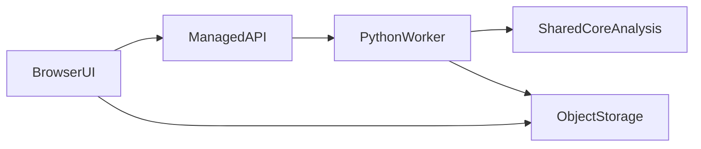

# Web MVP Scope (Post-Desktop)

This file captures the evaluated and scoped web path after desktop parity.

## Objective

Allow users to upload their own videos in a browser and get crater metrics and overlays with minimal operations overhead.

## Recommended MVP

- Frontend: React + TypeScript
- Processing path:
  - Phase A: server-side processing API using the same Python core modules
  - Phase B (optional): client-side preview with WebAssembly/OpenCV.js for short clips
- Hosting:
  - Frontend on Vercel/Netlify
  - API on managed container platform (Cloud Run/Render/Fly)
  - Object storage for uploads/results (S3/R2/GCS)

## Why not browser-only first

- Long/high-resolution videos are memory heavy in browsers.
- Codec support differs across browsers.
- Porting all OpenCV/Numpy logic to WASM/JS increases implementation risk.

## MVP Feature List

- Upload video file
- Pick analysis preset (or defaults)
- Run analysis job
- View frame overlay previews
- Download metrics CSV and session JSON

## Architecture

## Estimated Effort

- API + job queue + storage integration: 1-2 weeks
- Web UI upload/results flow: 1 week
- Hardening, auth, quota, reliability: 1-2 weeks

## Ops Profile

- Low ops but not zero:
  - Monthly managed hosting bill
  - Monitor failed jobs
  - Basic abuse/rate limits

